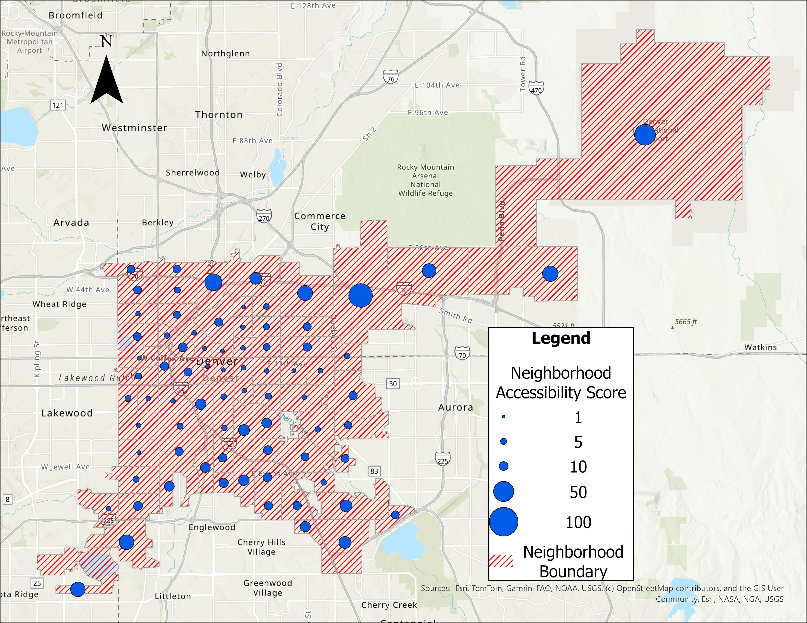

# Denver 15-Minute City Accessibility Tool

## Overview
A custom ArcPy geoprocessing tool built in ArcGIS Pro to quantify 
and rank neighborhood-level accessibility to essential urban services 
across Denver using the 15-minute city framework.

## What the Tool Does
- Measures accessibility to schools, parks, food retail, 
  healthcare, and public transit for each neighborhood
- Generates following scores per neighborhood:
     Neighborhood Accessibility Score — how reachable those services are
- Applies configurable buffer distances for multi-scale analysis
- Assigns weighted scores to prioritize less abundant but 
  critical services like healthcare

Weights are assigned to each service category to account for relative 
scarcity and importance — for example, healthcare facilities receive 
higher weight than parks since they are less abundant but more critical.

Buffer distances are fully configurable, allowing analysis at different 
scales of accessibility (e.g., strict walkability vs. broader 
neighborhood reach). Note: buffers measure Euclidean distance, so 
smaller buffer values yield more accurate walkability estimates.

## Data Sources
- [Denver Open Data Catalog](https://www.denvergov.org/opendata)
- [CDPHE Open Catalog](https://cdphe.colorado.gov)

## Requirements
- ArcGIS Pro (with ArcPy)
- Python 3.x (bundled with ArcGIS Pro)
- Input shapefiles (see Data Sources above)

## How to Run
1. Download required shapefiles from the sources above
2. Place all shapefiles in a single input folder
3. Open ArcGIS Pro and load the tool from the toolbox
4. Set the input folder path and configure buffer distances
5. Run the tool — output will be a ranked neighborhood layer

## Output

